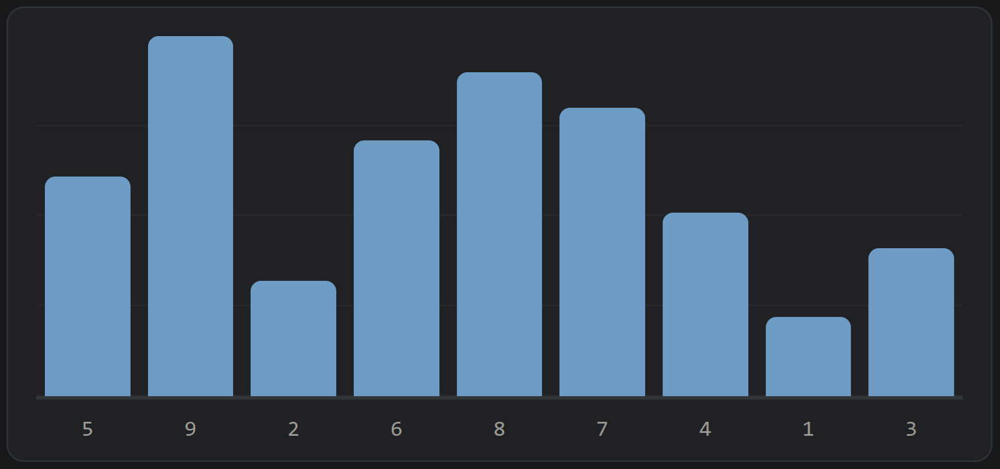

# Sorttoy

Herramienta para enseñar algoritmos de ordenamiento ejecutándolos a mano. Muestra un arreglo de barras desordenadas que se intercambian arrastrando, y permite marcar las posiciones que ya quedaron ordenadas.

Pensada para **25.03 — Algoritmos y Estructuras de Datos**, Ingeniería Electrónica, ITBA.

[](https://mressl-itba.github.io/sorttoy/)

**Demo:** <https://mressl-itba.github.io/sorttoy/>

## Por qué

Los visualizadores de ordenamiento habituales animan el algoritmo solos: el alumno mira una animación y no ejecuta nada. Aquí ocurre lo contrario. Cada intercambio lo hace una persona, con la mano, y el contador registra cuántos hicieron falta. Eso convierte la clase en una ejecución paso a paso en lugar de una demostración pasiva, y deja un número concreto para contrastar contra la cota teórica del algoritmo.

## Uso

Dos gestos, sin modos:

| Gesto | Efecto |
| --- | --- |
| Arrastrar una barra sobre otra | Las intercambia |
| Clic sobre una barra | La marca o desmarca en ámbar |

Las marcas sirven para señalar el tramo del arreglo que ya está resuelto: el prefijo en selection sort, el sufijo en bubble sort. **Pertenecen a la posición, no al valor**, así que si intercambias una barra marcada la marca se queda donde estaba.

Cuando el arreglo queda completamente ordenado, todas las barras pasan a verde.

### Controles

- **Mezclar** — genera un arreglo nuevo y reinicia los contadores.
- **Deshacer** — revierte el último intercambio, con historial de hasta 200 pasos.
- **Limpiar marcas** — saca todas las marcas sin tocar el arreglo.
- **Barras** — entre 4 y 16. Para clase, 8 o 9 es el punto donde el gesto sigue siendo ágil.
- **Copiar registro** — copia la secuencia completa de intercambios al portapapeles, para pegarla en Discord o en un informe.

### Teclado

| Tecla | Efecto |
| --- | --- |
| <kbd>&larr;</kbd> <kbd>&rarr;</kbd> | Mueven el foco entre barras |
| <kbd>Enter</kbd> | Marca o desmarca la barra enfocada |
| <kbd>Shift</kbd> + <kbd>&larr;</kbd> / <kbd>&rarr;</kbd> | Intercambia con la barra vecina |

El modo teclado sirve para proyectar sin depender del mouse, y hace que la herramienta sea usable con lector de pantalla.

## Ideas para la clase

- **Selection sort.** Marcar la posición 0, buscar el mínimo entre las no marcadas, arrastrarlo a la posición marcada. Repetir. Se ve enseguida que el tramo marcado nunca se vuelve a tocar.
- **Bubble sort.** Recorrer de izquierda a derecha intercambiando pares adyacentes con <kbd>Shift</kbd>+<kbd>&rarr;</kbd>. Al terminar la pasada, marcar la última posición. La cantidad de marcas cuenta las pasadas.
- **Insertion sort.** La versión con desplazamientos se hace con intercambios sucesivos hacia la izquierda, que es <kbd>Shift</kbd>+<kbd>&larr;</kbd> repetido hasta ubicar el elemento.
- **Competencia.** Todos parten del mismo arreglo y gana quien lo ordena con menos intercambios. El registro copiado permite revisar la secuencia después.

## Ejecutar y publicar

Es un único archivo HTML sin dependencias: no carga fuentes, ni CDNs, ni bibliotecas. Funciona sin conexión abriéndolo con doble clic, y sigue el modo claro u oscuro del sistema.

Para publicarlo con GitHub Pages:

1. Coloca `index.html` en la raíz del repositorio.
2. En **Settings → Pages**, elige la rama `main` y la carpeta `/ (root)`.
3. En un par de minutos queda disponible en `https://<usuario>.github.io/<repo>/`.

Si prefieres tenerlo junto a otros materiales sin crear un repositorio aparte, coloca el archivo en `docs/` y elige `main` + `/docs` en Pages.

> El botón de copiar registro usa la Clipboard API, que requiere contexto seguro. Publicado por HTTPS funciona directo; abierto con `file://` cae a un método alternativo que también funciona.

## Estructura

```
.
├── index.html    # la herramienta completa: markup, estilos y lógica
├── bars.png      # captura usada en este README
├── LICENSE
└── README.md
```

Todo el código está en ese archivo, sin proceso de compilación. Los colores salen de variables CSS declaradas en `:root`, con redefiniciones en el bloque `@media (prefers-color-scheme: dark)`, así que se cambia el tema modificando solo esa parte.

## Licencia

MIT.
